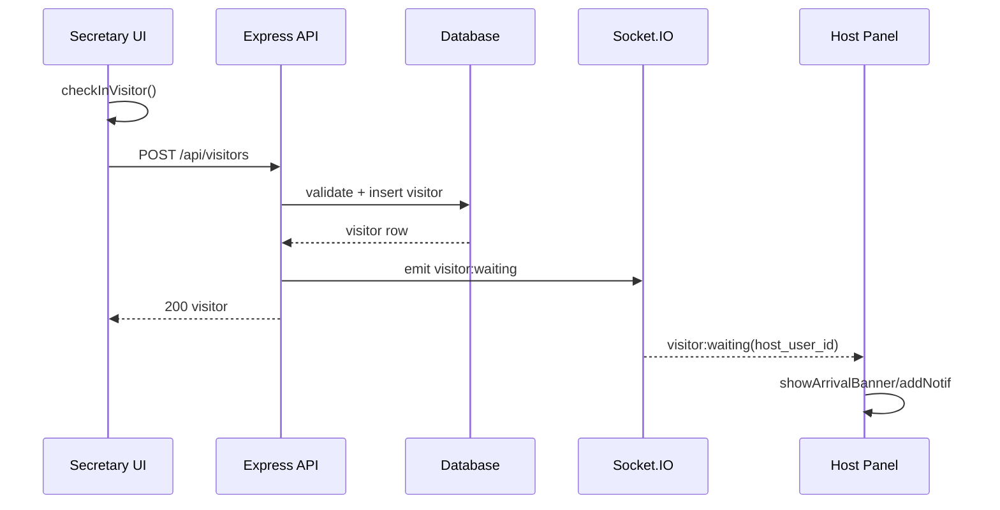
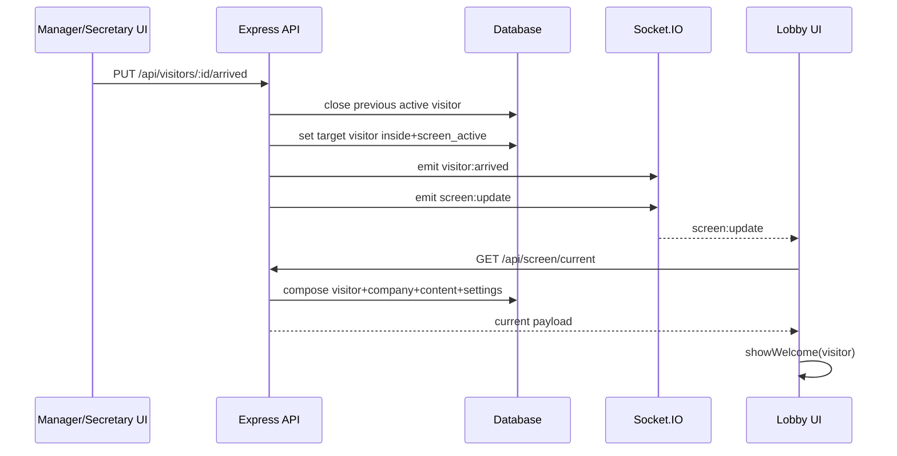
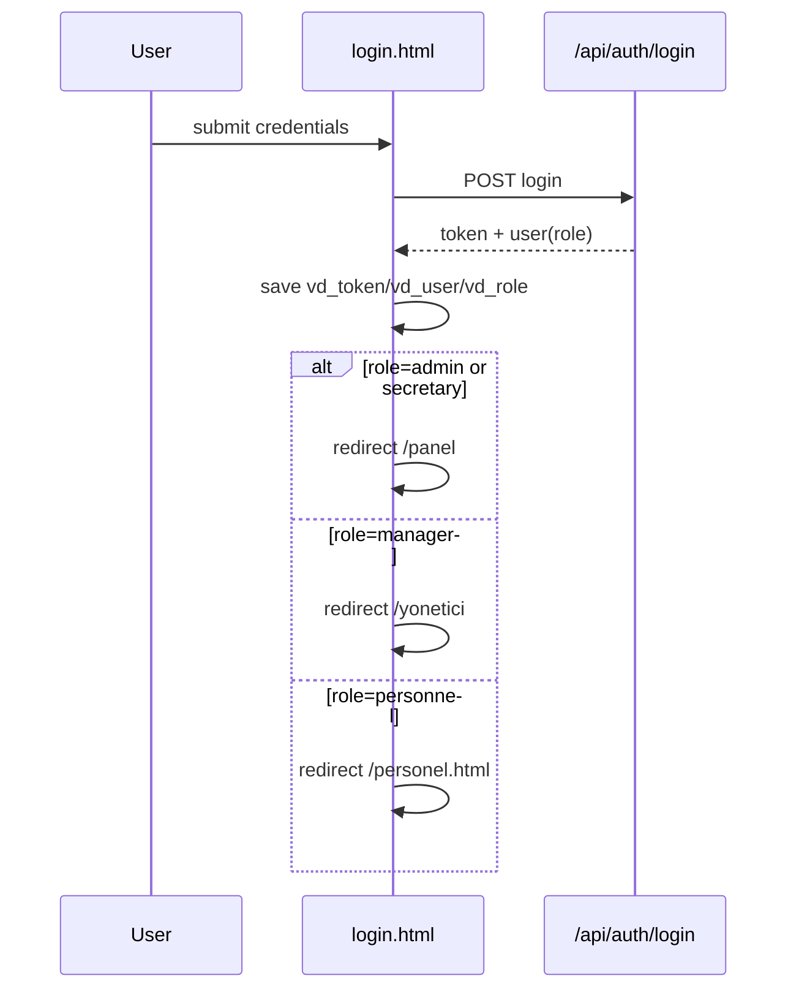
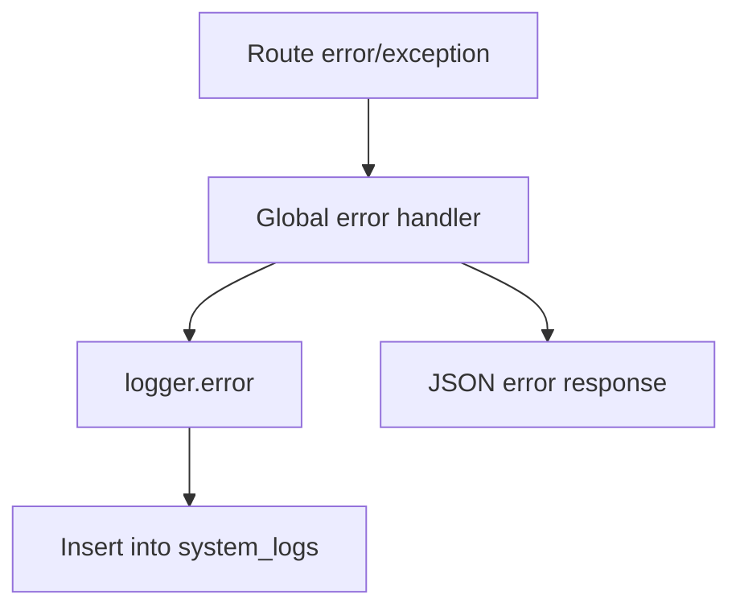

# Digital Visitor System - Full Technical Handover (English)

**Table of Contents (Line Numbers)**

| Section | Lines | Description |
|---------|-------|-------------|
| 1. Project Identity and Runtime | 45-61 | Runtime, entry points, auth method, NPM scripts |
| 2. High-Level Folder Map | 64-96 | Root, public/, server/, tests/ structure |
| 3. Startup and Boot Sequence | 98-135 | Backend chain, DB bootstrap sequence |
| 4. Frontend Entry Points | 137-179 | Login, panels (secretary/manager/personnel), lobby |
| 5. Shared API Client Contract | 181-199 | api-client.js methods by domain |
| 6. Secretary Panel Function Map | 201-256 | public/app.js major functions |
| 7. Manager Panel Function Map | 258-282 | public/yonetici.html functions |
| 8. Personnel Panel Function Map | 284-305 | public/personel.html functions |
| 9. Lobby Screen Function Map | 307-328 | public/lobi.html functions |
| 10. Backend Route Map | 330-449 | All routes mounted and their behaviors |
| 11. Middleware and Cross-Cutting | 451-479 | Auth, validation, logger, rate limiting |
| 12. Data Model Summary | 481-503 | Core tables and relational concepts |
| 13. Realtime Event Contract | 505-526 | Socket.IO events (emitted/consumed) |
| 14. Utility Scripts | 528-577 | Root helper scripts descriptions |
| 15. Seeds and Initial Data | 579-589 | seed-auto.js and seed.js |
| 16. Testing | 591-608 | What's verified in integration tests |
| 17. End-to-End User Flows | 610-639 | Login, check-in, approval, checkout flows |
| 18. Architectural Notes | 641-650 | Key notes for maintainers |
| 19. Quick "Where do I edit X?" Index | 652-670 | File-to-feature mapping |
| 20. Suggested First Actions | 672-685 | Reading order for new maintainers |
| 21. Function Call Graph | 687-941 | Granular invocation chains |
| 22. Environment Variables | 943-962 | Required/optional env matrix |
| 23. Role-Permission Matrix | 964-1000 | UI + API permissions by role |
| 24. API Contract Catalog | 1002-1056 | Operational endpoint contracts |
| 25. State Transition Matrix | 1058-1082 | Visitor and appointment status flows |
| 26. Data Dictionary | 1084-1136 | Core table schemas |
| 27. Failure/Incident Playbook | 1138-1193 | Common issues and fixes |
| 28. Test Coverage Map | 1195-1214 | Covered vs recommended gaps |
| 29. Deployment/Backup Runbook | 1216-1253 | Deploy, backup, restore, rollback |
| 30. Technical Debt Register | 1255-1267 | Known debt and suggested fixes |
| 31. Mermaid Diagrams | 1269-1344 | Sequence and flow diagrams |
| 32. Recent Changes Log | 1346-1393 | March 2026 changelog |

This document is a deep handover map for a new language model or new maintainer.
It explains where everything lives, which script/function starts from where, and how panels, APIs, realtime events, and data flow work end-to-end.

---

## 1) Project Identity and Runtime

- Project name: `dijital-ziyaretci-sistemi`
- Runtime: Node.js + Express + Socket.IO + sql.js (SQLite file)
- Main entry point: `server/index.js`
- Frontend style: Multi-page app (plain HTML + JS), not SPA framework-based
- Persistent data: SQLite file via `sql.js` sync wrapper in `server/database.js`
- Frontend auth/session: `sessionStorage` (`vd_token`, `vd_user`, `vd_role`)

### NPM Scripts
Defined in `package.json`:

- `npm start` -> `node server/index.js`
- `npm run dev` -> `node server/index.js`
- `npm run seed` -> `node server/seed.js`
- `npm test` -> `node --test tests/**/*.test.js`

---

## 2) High-Level Folder and Responsibility Map

## Root
- `package.json`: scripts and dependencies
- `index.html`, `style.css`, `app.js`, `db.js`: legacy local/demo frontend prototype layer
- Utility scripts (`check-*.js`, `fix-*.js`, etc.): one-off diagnostics/migration helpers

## Public frontend (`public/`)
- `login.html`: login screen and role-based redirect
- `index.html`: secretary/admin panel shell
- `app.js`: main secretary/admin panel controller logic
- `yonetici.html`: manager panel (inline JS)
- `personel.html`: personnel panel (inline JS)
- `lobi.html`: lobby display screen
- `api-client.js`: shared authenticated API helper used by panels
- `style.css`: secretary panel styles
- `Assets/`: logos/sounds/media

## Backend (`server/`)
- `index.js`: server bootstrap + middleware + static + route mount + Socket.IO + live-reload event
- `database.js`: sql.js wrapper + schema + indexes + default settings + migration-like normalization
- `seed.js`: full demo seed script
- `seed-auto.js`: automatic first-run seed if users table empty
- `middleware/auth.js`: JWT auth + active user check
- `middleware/validate.js`: reusable request validators
- `routes/*.js`: API modules by domain
- `utils/logger.js`: writes system logs into DB
- `uploads/`: media files uploaded by content/settings endpoints

## Tests (`tests/`)
- `api.integration.test.js`: integration tests for auth, CRUD flows, pages, permissions, and performance-like constraints

---

## 3) Startup and Boot Sequence (Exact Flow)

### Backend startup chain
1. `npm start` launches `server/index.js`
2. `dotenv` loads env
3. Express app + HTTP server + Socket.IO server created
4. `global.io` is set (used inside route files to emit events)
5. Middleware stack is configured:
   - CORS
   - rate limit (`/api/auth/login` and `/api`)
   - JSON/urlencoded parsers
   - `/uploads` static mount
6. Page routes registered before static:
   - `/` -> `public/login.html`
   - `/panel` -> `public/index.html`
   - `/yonetici` -> `public/yonetici.html`
   - `/lobi` -> `public/lobi.html`
7. Static files served from `public`
8. API routers mounted under `/api/...`
9. Global error handler installed
10. `start()` executes:
   - `await initDB()` (schema/index/default settings normalization)
   - tries `require('./seed-auto')`
   - starts HTTP listener
   - starts `fs.watch` live-reload and emits `system:reload`

### DB bootstrap chain
Inside `server/database.js` `initDB()`:
1. Creates/opens DB file from `DB_PATH` env or default `./server/database.db`
2. Ensures all tables exist
3. Ensures indexes exist
4. Ensures default settings rows exist
5. Normalizes historical naming/branding values
6. Ensures company dictionary exists + default company reset
7. Fixes user/personnel linking (`user_id` repair + host propagation)
8. Returns DB instance

---

## 4) Frontend Entry Points and Routing by User Role

### Login entry (`public/login.html`)
- Main login handler posts to `/api/auth/login`
- On success stores:
  - `vd_token`
  - `vd_user`
  - `vd_role`
- Role redirect rules:
  - `admin` -> `/panel`
  - `secretary` -> `/panel`
  - `manager` -> `/yonetici`
  - `personnel` -> `/personel.html`

### Secretary/Admin panel (`public/index.html` + `public/app.js`)
- On `DOMContentLoaded` in `public/app.js`:
  1. `checkAuth()` from `api-client.js`
  2. sidebar user info setup
  3. `startClock()`
  4. `setGreeting()`
  5. `initSocket()`
  6. `applyPanelBranding()`
  7. `loadPage('dashboard')`
- Navigation dispatch:
  - `navigate(page)` -> `loadPage(page)`
  - `loadPage` routes to domain loaders (`loadVisitors`, `loadCheckinPage`, `loadAppointments`, etc.)

### Manager panel (`public/yonetici.html`)
- Inline script boot loads current user, KPIs, waiting list, inside list, appointments, rooms
- Socket listeners feed notification panel and banners
- Focus: manager-host workflow and approvals

### Personnel panel (`public/personel.html`)
- Inline script boot loads current user context, own visitors/appointments, rooms
- Socket listeners scoped to matching `host_user_id`
- Focus: host-side visibility and quick interactions

### Lobby screen (`public/lobi.html`)
- Polls `/api/screen/current`
- Listens to socket updates for `screen:update`, visitor lifecycle, and reload event
- Dynamically switches between welcome/default states and media backgrounds

---

## 5) Shared API Client Contract (`public/api-client.js`)

Core functions:
- `getToken()`, `getUser()`, `clearSession()`, `logout()`
- `checkAuth()`
- `apiFetch(path, options)` (adds Bearer token, handles 401 redirect)

`api` object methods (grouped):
- Auth: `me`, `changePassword`
- Users: `getUsers`, `createUser`, `updateUser`, `deleteUser`
- Visitors: `getVisitors`, `getVisitorStats`, `createVisitor`, `arrivedVisitor`, `verifyVisitor`, `approveVisitor`, `rejectVisitor`, `checkoutVisitor`, `cancelVisitor`, `deleteVisitor`
- Personnel: `getPersonnel`, `createPersonnel`, `updatePersonnel`, `deletePersonnel`
- Companies: `getCompanies`, `createCompany`, `updateCompany`, `deleteCompany`, `setDefaultCompany`
- Appointments: `getAppointments`, `createAppointment`, `updateAppointment`, `cancelAppointment`, `deleteAppointment`
- Rooms: `getRooms`, `createRoom`, `setRoomStatus`
- Blacklist: `getBlacklist`, `checkBlacklist`, `addBlacklist`, `deleteBlacklist`
- Screen/settings/content/logs: `getScreenState`, `getSettings`, `updateSettings`, `getContents`, `getSystemLogs`

---

## 6) Secretary Panel Function Map (`public/app.js`)

This is the largest frontend controller. Key sections:

### Core shell/system
- `initSocket`: binds socket events and refreshes dashboard/toasts
- `navigate`, `loadPage`, `toggleSidebar`
- `startClock`, `setGreeting`, `showToast`, `playNotificationSound`

### Dashboard and visitor lifecycle
- `refreshDashboard` (Son Ziyaretçiler now shows host_name, host_company_name, and Çıkış button for inside visitors)
- `arrivedVisitor`, `verifyPersonnelGuest`, `declinePersonnelGuest`
- `checkoutAction`, `showVisitorDetail`, `exportCSV`
- Onay Bekleyenler section now shows `host_company_name` (which company the guest visits)

### Visitor list and filtering
- `loadVisitors`, `renderVisitorsTable`, `filterVisitors`, `filterVisitorsDate`, `globalSearch`

### Fast check-in
- `loadCheckinPage`, `updatePreview`, `loadRecentCheckins`, `checkBlacklist`, `checkInVisitor`, `clearCheckinForm`
- Host-assignment helpers:
  - `normalizeCompanyName`, `collectUniqueCompanyNames`, `normalizeText`
  - `buildHostSuggestionList`
  - `fillHostDatalist`
  - `resolveHostIdFromText`
  - `setupHostSuggestionInput`

### Appointments
- `loadAppointments`, `showAppointmentModal`, `saveAppointment`, `cancelAppt`
- calendar/export helpers: `renderCalendarBlock`, `openGoogleCalendar`, `downloadICS`

### Rooms
- `loadRooms`, `showRoomReservationFor`, `submitRoomReservation`, `cancelReservation`

### Personnel and blacklist
- `loadPersonnel`, `showHostModal`, `saveHost`, `deleteHost`
- Secretary user management: `showUserModal`, `saveUser`, `deleteUser`
- Company filter bubbles: `setPersonnelCompanyFilter` with `addEventListener`-based buttons (not inline onclick, to avoid HTML quote escaping issues)
- `loadBlacklist`, `showBlacklistModal`, `addToBlacklist`, `removeFromBlacklist`

### Settings/admin area
- `switchSettingsTab`, `loadSettings`
- Companies/users: `loadCompaniesList`, `loadUsers`, `showUserModal`, `saveUser`, `showCompanyModal`, `saveCompany`, `setDefaultCompany`, `deleteCompany`
- System/lobby/content/logs:
  - `loadSystemSettings`, `saveSystemSettings`
  - `loadLobbySettings`, `saveSettingsAlt`, `uploadLobbyLogo`
  - `loadScreensContent`, `uploadMediaFile`, `deleteContent`
  - `loadSystemLogs`
- Password modal: `showChangePasswordModal`, `submitPasswordChange`

### Utility formatters
- `statusLabel`, `apptStatusLabel`, `formatTime`, `formatDate`, `calcDuration`, `drawTrafficChart`, `applyPanelBranding`

Note: `showModal`/`closeModal` appear in more than one place in this file; there is duplication/override risk in long-term maintenance.

---

## 7) Manager Panel Function Map (`public/yonetici.html`)

Major function clusters:

- UI basics: `showToast`, `showModal`, `closeModal`
- New record modal: `switchModalTab`, `openAddVisitorModal`, `closeAddVisitorModal`, `submitAddVisitor`
  - Host field is hidden (`display:none`); auto-detects logged-in user's personnel record by `user_id` match with `full_name` fallback
- Notifications: `toggleNotifications`, `addNotif`, `clearNotifs`
- Arrival attention flow: `showArrivalBanner`, `closeBanner`, `bannerApprove`, `bannerReject`, `playDoorbell`
- Data loading: `loadAll`, `loadStats`, `loadWaiting`, `loadInside`, `loadTodayAll`, `loadAppointments`
- Calendar filter: `renderCalendar`, `changeMonth`, `filterByDate`, `resetApptFilter`
- Appointment actions: `cancelAppt`, `openGoogleCalendar`, `downloadICS`
- Room workflow: `loadRooms`, `showRoomReservation`, `submitRoomReservation`, `cancelReservation`
- Visitor state actions: `approveV`, `rejectV`, `checkoutV`
- Branding/auth helpers: `applyPanelBranding`, `showChangePasswordModal`, `submitPasswordChange`
- Outlook: `connectOutlook`, `syncOutlook`

Socket behavior:
- `visitor:waiting` -> banner + notification + refresh
- `visitor:approved` -> doorbell sound + toast + notification (filtered by `host_user_id` match)
- `visitor:arrived` -> notification + refresh
- `visitor:rejected` -> doorbell sound + toast + notification (filtered by `host_user_id` match)
- `system:reload` -> full page reload

---

## 8) Personnel Panel Function Map (`public/personel.html`)

Major function clusters:
- UI and notifications: `showToast`, `toggleNotifications`, `addNotif`, `clearNotifs`
- Arrival attention flow: `showArrivalBanner`, `closeBanner`, `playDoorbell`
- New visitor/randevu modal: `switchModalTab`, `openAddVisitorModal`, `closeAddVisitorModal`, `submitAddVisitor`
  - Host field is hidden (`display:none`); auto-detects logged-in user's personnel record by `user_id` match with `full_name` fallback
  - Personnel creating a visitor record goes to sekreter for approval (`is_approved=0`)
- Data: `loadAll`, `loadTodayAll`, `loadAppointments`, `loadRooms`
- Room reservation: `showRoomReservation`, `submitRoomReservation`, `cancelReservation`
- Helpers: `fmt`, `renderCalendarBlock`, `showModal`, `closeModal`
- User branding/account: `applyPanelBranding`, `loadCurrentUserCompany`, `showChangePasswordModal`, `submitPasswordChange`

Socket behavior:
- `visitor:waiting` filtered by matching `host_user_id` -> banner + doorbell + notification
- `visitor:approved` filtered by matching `host_user_id` -> doorbell + toast + notification (sekreter onayı sonrası)
- `visitor:arrived` filtered by matching `host_user_id` -> toast + notification
- `visitor:rejected` filtered by matching `host_user_id` -> doorbell + toast + notification
- `visitor:checkout` filtered by matching `host_user_id` -> notification
- `system:reload` reloads page

---

## 9) Lobby Screen Function Map (`public/lobi.html`)

Key lifecycle functions:
- `updateClock`
- `loadScreenState`
- `showWelcome` (no longer sets `welcome-company` — element removed), `showDefault`, `hideContent`
- `updateBackground`
- `applyLayout`
- `triggerVideoCooldown`
- `logContent`
- `setConn`, `playNotification`
- `syncViewportMode`, `setManualRotate`, `toggleManualRotate`, `toggleFullscreen`

Primary behavior:
- Poll current state via `/api/screen/current`
- Show visitor welcome when active inside visitor exists (shows host name + host company only; visitor company label removed)
- Otherwise show default company content and branding (centered with glass-card styling)
- Default screen keeps `with-bg` class even when media is disabled (centering preserved)
- `screen-hide` class uses `position: absolute !important` so hidden screens don't push visible ones off-center
- Can autoplay configured media depending on settings

---

## 10) Backend Route Map and Behavior

Mounted in `server/index.js`:

- `/api/auth` -> `routes/auth.js`
- `/api/users` -> `routes/users.js`
- `/api/visitors` -> `routes/visitors.js`
- `/api/personnel` -> `routes/personnel.js`
- `/api/companies` -> `routes/companies.js`
- `/api/contents` -> `routes/contents.js`
- `/api/appointments` -> `routes/appointments.js`
- `/api/rooms` -> `routes/rooms.js`
- `/api/blacklist` -> `routes/blacklist.js`
- `/api/screen` -> `routes/screen.js`
- `/api/logs` -> `routes/logs.js`
- `/api/settings` -> `routes/settings.js`
- `/api/outlook` -> `routes/outlook.js`

### Auth (`routes/auth.js`)
- POST `/login`
- GET `/me`
- POST `/logout`
- POST `/change-password`

### Users (`routes/users.js`)
- GET `/` (admin/secretary)
- POST `/` create user (company selection mandatory; role constraints)
  - Note: `lastInsertRowid` from better-sqlite3 can return BigInt; code uses `Number()` conversion + username fallback lookup
- PUT `/:id` update user
- DELETE `/:id` soft deactivate (admin and secretary; secretary restricted to secretary/personnel roles only)

Important internal functions:
- `ensurePersonnelRecordsForUsers`
- `syncPersonnelCompanyForUser` (called BEFORE `ensurePersonnelRecordsForUsers` on create to avoid NULL company_id)
- `normalizeCompanyId`

### Visitors (`routes/visitors.js`)
Main lifecycle:
- POST `/` create visitor (blacklist check, host mapping)
- PUT `/:id/verify` secretary verification
- PUT `/:id/arrived` set inside and screen active
- PUT `/:id/approve` manager approval and inside
- PUT `/:id/reject`
- PUT `/:id/checkout`
- PUT `/:id/cancel`
- GET `/stats`, GET `/active`, GET `/`, GET `/:id`, DELETE `/:id`

Visitors GET query now includes `host_company_name` via `LEFT JOIN companies c ON c.id = p.company_id`.

Socket emissions from this route include:
- `visitor:waiting` (includes `host_user_id`)
- `visitor:approved` (includes `visitor` object + `host_user_id` + `by`)
- `visitor:arrived` (includes `visitor` object)
- `visitor:rejected` (includes full `visitor` object + `reason` + `by` — previously only sent `visitor_id`)
- `visitor:checkout`
- `visitor:cancelled`
- `screen:update`

### Personnel (`routes/personnel.js`)
- GET list/detail
- POST create
- PUT update
- DELETE soft deactivate
- Secretary is restricted from modifying personnel directly

### Companies (`routes/companies.js`)
- GET list
- POST create
- PUT update
- PUT `/:id/default`
- DELETE soft deactivate with guards (cannot remove last active company)

### Contents (`routes/contents.js`)
- GET list/detail
- POST `/upload` media upload via multer
- POST create text content
- PUT update metadata
- DELETE content + physical file cleanup

### Appointments (`routes/appointments.js`)
- GET list with filters
- POST create
- PUT update
- PUT `/:id/cancel`
- DELETE `/:id`

### Rooms (`routes/rooms.js`)
- GET rooms + active reservations
- POST create room
- PUT status / update room
- POST reserve (conflict check)
- DELETE reservation (status cancel)

### Blacklist (`routes/blacklist.js`)
- GET list
- GET `/check/:tc` (public check endpoint)
- POST add
- DELETE remove

### Screen (`routes/screen.js`)
- GET `/current` returns visitor/company/content/settings composite
- POST `/log` writes content start/end metrics

### Logs (`routes/logs.js`)
- GET `/activity`
- GET `/system`
- GET `/screen`
- GET `/export` (visitor CSV)

### Settings (`routes/settings.js`)
- GET all settings
- PUT bulk update (admin only)

### Outlook (`routes/outlook.js`)
- GET `/login` start OAuth
- GET `/callback`
- POST `/sync`
- currently partly mock/taslak depending on env credentials

---

## 11) Middleware and Cross-Cutting Concerns

### Auth middleware (`server/middleware/auth.js`)
Flow:
1. Extract Bearer token
2. Verify JWT
3. Query active user in DB
4. Attach `req.user`

### Validation middleware (`server/middleware/validate.js`)
Reusable validators:
- `requireFields`
- `maxLength`
- `validateTC`
- `enumField`
- `validateDate`
- `intField`
- `chain`

### Logger (`server/utils/logger.js`)
- Writes structured rows into `system_logs`
- Used by global error handler and can be used in routes

### Rate limiting
Configured in `server/index.js`:
- login route has stricter limiter
- all `/api` requests have broader limiter

---

## 12) Data Model Summary

Core tables from `server/database.js`:
- `users`
- `companies`
- `personnel`
- `visitors`
- `appointments`
- `rooms`
- `room_reservations`
- `blacklist`
- `contents`
- `activity_logs`
- `screen_logs`
- `system_settings`
- `system_logs`

Important relational concept:
- Host identity can be represented by both `host_personnel_id` and `host_user_id`
- Startup normalization tries to backfill missing `host_user_id` from personnel links
- `personnel.user_id` is the bridge between user account and host card

---

## 13) Realtime Event Contract (Socket.IO)

### Emitted by backend
From visitor flows:
- `visitor:waiting`
- `visitor:approved`
- `visitor:arrived`
- `visitor:rejected`
- `visitor:checkout`
- `visitor:cancelled`
- `screen:update`

From server file watcher:
- `system:reload`

### Consumers
- Secretary panel: toast + dashboard refresh
- Manager panel: banner/notif + action affordances
- Personnel panel: host-specific notification and refresh
- Lobby panel: screen refresh state transition

---

## 14) Utility Scripts in Root (What they do)

These are helper scripts, generally run manually via `node <script>`.

- `add-personel.js`
  - Ensures `personel` user exists and updates/creates credentials + personnel row

- `create-user-via-api.js`
  - Logs in via HTTP API and creates a user/personnel through API calls
  - Note: payload may become stale if API requirements change

- `check-schema.js`
  - Prints selected table schema column names

- `check-links.js`
  - Prints users and personnel records to inspect `user_id` links

- `check-assignments.js`
  - Prints visitor/appointment host assignment fields

- `check-time.js`
  - Prints localtime vs UTC from DB function

- `check-user.js`
  - Checks if username `personel` exists

- `check-user-5.js`
  - Prints visitor/appointment rows for `host_user_id=5`

- `fix-db.js`
  - Attempts to add appointment columns if missing (migration helper)

- `fix-personnel-links.js`
  - Repairs personnel `user_id` links and backfills host ids in visitors/appointments

- `db.js`
  - Legacy in-browser localStorage mock DB layer (seeded sample data)
  - Not the active backend DB used by Express API

- `app.js` (root)
  - Legacy front-end controller for localStorage/demo mode
  - Not the active server-backed panel used at `/panel`

- `index.html` (root)
  - Legacy static panel shell tied to root `app.js` / `db.js`

Operational recommendation:
- Treat root legacy trio (`index.html`, `app.js`, `db.js`) as historical/demo unless intentionally re-activated.

---

## 15) Seeds and Initial Data Logic

### `server/seed-auto.js`
- Runs automatically on startup if users table is empty
- Creates users, companies, personnel, rooms, blacklist, sample visitors, sample appointments

### `server/seed.js`
- Manual full seed script
- Similar data set but intended for explicit reset/seed flows

---

## 16) Testing: What is Verified

`tests/api.integration.test.js` covers:
- bootstrap and token-based auth
- page route availability (`/`, `/panel`, `/yonetici`, `/lobi`)
- auth endpoint behavior and password policy
- secretary permissions for user creation/updates
- personnel CRUD-like flow
- company flow
- room flow and reservation behavior
- visitor flow and approval lifecycle (in later sections of file)
- general route consistency

Test runtime specifics:
- Uses temporary test DB path and upload directory under `tests/.tmp-test-runtime`
- Uses `supertest` against `app` exported from `server/index.js`

---

## 17) Common End-to-End User Flows

### Flow A: Login -> panel entry
1. User submits credentials on `login.html`
2. POST `/api/auth/login`
3. Token/user persisted in sessionStorage
4. Redirect based on role

### Flow B: Secretary fast check-in
1. Secretary opens check-in page (`loadCheckinPage`)
2. Host suggestions are built from personnel cache
3. Form submit calls `checkInVisitor`
4. POST `/api/visitors`
5. Backend emits `visitor:waiting`
6. Host panels receive notification depending on `host_user_id`

### Flow C: Host accepts visitor
1. Manager/personnel sees waiting visitor and approves/arrives
2. PUT `/api/visitors/:id/approve` or `/arrived`
3. Backend updates statuses, screen flags and logs
4. Emits `visitor:arrived` and `screen:update`
5. Lobby and host panels update

### Flow D: Checkout
1. Host/secretary triggers checkout action
2. PUT `/api/visitors/:id/checkout`
3. Backend sets `status='left'`, `checkout_time`, clears screen active
4. Emits `visitor:checkout` and `screen:update`

---

## 18) Known Architectural Notes for Next Model

1. There is an active server-backed frontend in `public/`, and a legacy localStorage frontend in root files.
2. `public/app.js` is large and multi-domain; function naming collisions (`showModal`) exist.
3. Visitor host mapping relies on both personnel and users; startup normalization already tries to heal old data.
4. Some integrations (Outlook) are partially mock depending on env config.
5. Brand normalization and default company enforcement are embedded in DB init.
6. Socket event naming is central to cross-panel synchronization; changing event payloads requires coordinated frontend updates.

---

## 19) Quick "Where do I edit X?" Index

- Login behavior -> `public/login.html`, `server/routes/auth.js`
- Secretary panel UI and logic -> `public/index.html`, `public/app.js`
- Manager panel -> `public/yonetici.html`
- Personnel panel -> `public/personel.html`
- Lobby behavior -> `public/lobi.html`, `server/routes/screen.js`
- API auth/roles -> `server/middleware/auth.js`, `server/routes/users.js`
- Visitor lifecycle -> `server/routes/visitors.js`
- Company logic -> `server/routes/companies.js`
- Content uploads -> `server/routes/contents.js`, `server/uploads/`
- Settings and branding -> `server/routes/settings.js`, `public/app.js`, `server/database.js`
- Database schema/indexes/defaults -> `server/database.js`
- Seed users/data -> `server/seed-auto.js`, `server/seed.js`
- Realtime event producer -> `server/routes/visitors.js`, `server/index.js`
- Realtime event consumers -> `public/app.js`, `public/yonetici.html`, `public/personel.html`, `public/lobi.html`
- Integration tests -> `tests/api.integration.test.js`

---

## 20) Suggested First Actions for a New Model Session

1. Read `server/index.js` and `server/database.js` first.
2. Read `public/api-client.js` to understand frontend API contract.
3. Read role panel files in this order:
   - `public/index.html` + `public/app.js`
   - `public/yonetici.html`
   - `public/personel.html`
   - `public/lobi.html`
4. Read `server/routes/visitors.js` and `server/routes/users.js` (highest business impact).
5. Run tests (`npm test`) before/after changes.
6. If data inconsistency appears, inspect helper scripts (`check-*.js`, `fix-*.js`) before writing new migration logic.

---

## 21) Function-to-Function Call Graph (Granular)

This section maps concrete invocation chains. The format is:

- `UI/Event -> Frontend Function -> API Call -> Backend Route -> DB/Emit -> Frontend Consumers`

### 21.1 Login and Role Redirect Chain

- `login form submit (public/login.html)`
  -> inline submit handler
  -> `fetch('/api/auth/login')`
  -> `routes/auth.js` `POST /login`
  -> validates user + bcrypt + JWT
  -> returns token/user
  -> sessionStorage write (`vd_token`, `vd_user`, `vd_role`)
  -> role redirect (`/panel`, `/yonetici`, `/personel.html`)

### 21.2 Secretary Panel Boot Chain

- `DOMContentLoaded (public/app.js)`
  -> `checkAuth()`
  -> sidebar identity render
  -> `startClock()`
  -> `setGreeting()`
  -> `initSocket()`
  -> `applyPanelBranding()`
  -> `loadPage('dashboard')`
  -> `refreshDashboard()`
  -> API fanout:
  - `api.getVisitorStats()` -> `GET /api/visitors/stats`
  - `api.getVisitors({date:'today'})` -> `GET /api/visitors`
  - `api.getAppointments(...)` -> `GET /api/appointments`

### 21.3 Secretary Navigation Dispatch

- `navigate(page)`
  -> active page DOM toggles
  -> `loadPage(page)`
  -> branch:
  - `dashboard` -> `refreshDashboard()`
  - `visitors` -> `loadVisitors()` -> `renderVisitorsTable()`
  - `checkin` -> `loadCheckinPage()`
  - `appointments` -> `loadAppointments()`
  - `rooms` -> `loadRooms()`
  - `hosts` -> `loadPersonnel()`
  - `blacklist` -> `loadBlacklist()`
  - `settings` -> `loadSettings()`

### 21.4 Fast Check-in Chain

- `Kayıt Oluştur button`
  -> `checkInVisitor()`
  -> host resolution path:
  - `setupHostSuggestionInput()`
  - `buildHostSuggestionList()`
  - `resolveHostIdFromText()`
  -> payload compose
  -> `api.createVisitor(payload)`
  -> `POST /api/visitors` (`routes/visitors.js`)
  -> validation + blacklist check + host mapping
  -> `INSERT visitors`
  -> emits `visitor:waiting` (via `global.io.emit`)
  -> response to secretary
  -> secretary UI: toast + clear + dashboard refresh
  -> host panels consume `visitor:waiting`

### 21.5 Visitor Verify/Approve/Arrive/Checkout Chains

- `verify (secretary)`
  -> `verifyPersonnelGuest(id)`
  -> `api.verifyVisitor(id)`
  -> `PUT /api/visitors/:id/verify`
  -> `UPDATE is_approved=1`
  -> emit `visitor:approved`

- `arrived (secretary waiting list)`
  -> `arrivedVisitor(id)`
  -> `api.arrivedVisitor(id)`
  -> `PUT /api/visitors/:id/arrived`
  -> close previous active screen visitor
  -> update target visitor (`inside`, `arrival_time`, `is_screen_active=1`)
  -> emit `visitor:arrived` and `screen:update`

- `approve (manager)`
  -> `approveV(id)` in manager panel
  -> `api.approveVisitor(id)`
  -> `PUT /api/visitors/:id/approve`
  -> marks approved/inside/screen active
  -> emit `visitor:approved` and `screen:update`

- `reject (manager/secretary)`
  -> `rejectV(id)` or `declinePersonnelGuest(id)`
  -> `api.rejectVisitor(id, reason)`
  -> `PUT /api/visitors/:id/reject`
  -> status `cancelled`
  -> emit `visitor:rejected`

- `checkout`
  -> `checkoutAction(id)` / `checkoutV(id)`
  -> `api.checkoutVisitor(id)`
  -> `PUT /api/visitors/:id/checkout`
  -> status `left`, set checkout time, clear active screen
  -> emit `visitor:checkout` and `screen:update`

### 21.6 Socket Consumer Graph by Panel

- Secretary (`public/app.js` `initSocket`)
  - `visitor:waiting` -> `showToast` + `refreshDashboard`
  - `visitor:arrived` -> `showToast` + `playNotificationSound` + `refreshDashboard`
  - `visitor:approved` -> `showToast` + `refreshDashboard`
  - `visitor:rejected` -> `showToast(error)` + `refreshDashboard`
  - `visitor:checkout` -> `showToast` + `refreshDashboard`
  - `system:reload` -> `location.reload()`

- Manager (`public/yonetici.html`)
  - `visitor:waiting` -> `showArrivalBanner` + `addNotif` + `loadAll`
  - `visitor:approved` (if `host_user_id` match) -> `playDoorbell` + toast + `addNotif` + `loadAll`
  - `visitor:arrived` -> `addNotif` + `loadAll`
  - `visitor:rejected` (if `host_user_id` match) -> `playDoorbell` + toast + `addNotif`; else generic `addNotif`
  - `system:reload` -> reload

- Personnel (`public/personel.html`)
  - `visitor:waiting` (if `d.host_user_id == currentUser.id`) -> toast + `showArrivalBanner` + `loadAll`
  - `visitor:approved` (if `host_user_id` match) -> `playDoorbell` + toast + `addNotif` + `loadAll`
  - `visitor:arrived` (same filter) -> toast + `addNotif` + `loadAll`
  - `visitor:rejected` (if `host_user_id` match) -> `playDoorbell` + toast + `addNotif`
  - `visitor:checkout` (same filter) -> `addNotif` + `loadAll`
  - `system:reload` -> reload

- Lobby (`public/lobi.html`)
  - consumes `screen:update` and visitor lifecycle indirectly through `loadScreenState()` polling and socket refresh events

### 21.7 User Management Graph

- `saveUser(id)` (secretary/admin settings area)
  -> input validation (create requires company)
  -> branch:
  - create: `api.createUser(data)` -> `POST /api/users`
  - update: `api.updateUser(id, data)` -> `PUT /api/users/:id`
  -> backend (`routes/users.js`):
  - role authorization
  - password policy
  - company normalization
  - create/update users row
  - `syncPersonnelCompanyForUser(...)`
  - `ensurePersonnelRecordsForUsers()`
  -> returns enriched user row with company info

### 21.8 Company Management Graph

- `saveCompany(id)`
  -> `api.createCompany` or `api.updateCompany`
  -> backend `routes/companies.js`
  -> insert/update company row

- `setDefaultCompany(id)`
  -> `api.setDefaultCompany(id)`
  -> `PUT /api/companies/:id/default`
  -> reset all defaults then set one

- `deleteCompany(id)`
  -> `api.deleteCompany(id)`
  -> `DELETE /api/companies/:id`
  -> soft deactivate + active-company guard + default fallback guard

### 21.9 Appointments Graph

- `saveAppointment()` (secretary)
  -> create/update via `api.createAppointment` or `api.updateAppointment`
  -> backend `routes/appointments.js`
  -> host mapping from personnel to `host_user_id`
  -> insert/update

- `checkInAppointment(appt)` (secretary quick conversion)
  -> `api.createVisitor(...)`
  -> `api.cancelAppointment(appt.id)`
  -> produces visitor waiting flow and emits `visitor:waiting`

### 21.10 Rooms and Reservation Graph

- load rooms:
  -> `loadRooms()` (all panels)
  -> `api.getRooms()`
  -> `GET /api/rooms`
  -> returns rooms + active reservations merged

- reserve room:
  -> `submitRoomReservation()`
  -> `POST /api/rooms/:id/reserve`
  -> backend conflict query (`overlap`) then insert reservation

- cancel reservation:
  -> `cancelReservation(id)`
  -> `DELETE /api/rooms/reservations/:id`
  -> backend sets reservation status `cancelled`

### 21.11 Lobby Current State Graph

- lobby refresh loop:
  -> `loadScreenState()`
  -> `GET /api/screen/current`
  -> backend composes:
  - active inside visitor
  - default active company
  - selected content fallback chain
  - system settings map
  -> frontend applies:
  - `updateBackground(content, settings)`
  - `applyLayout(settings)`
  - `showWelcome(visitor)` or `showDefault()`

### 21.12 Middleware and Validation Graph

- Protected endpoint request:
  -> `auth` middleware
  -> JWT verify
  -> active user fetch
  -> route handler

- Visitor create/update validation example:
  -> `v.chain(...)` (`validate.js`)
  -> `requireFields`, `maxLength`, `validateTC`, `intField`, `validateDate`
  -> handler logic executes only after all validators pass

### 21.13 Error and Logging Graph

- Route throws/next(err)
  -> global error handler in `server/index.js`
  -> `logger.error('SERVER', ...)`
  -> insert into `system_logs`
  -> JSON error response

### 21.14 Performance-Related Invocation Notes

- Most list endpoints support `limit`/`offset` and cap max rows (typically 500/1000).
- DB indexes in `server/database.js` are aligned with hot queries:
  - visitors by status/date/host
  - appointments by planned_time/host
  - logs by created_at
  - personnel/users/company activity filters

### 21.15 Practical Debug Sequence (Call Graph Perspective)

If a user reports "host did not get notification":

1. Check secretary/client path reached `checkInVisitor()`.
2. Confirm API request hit `POST /api/visitors`.
3. Confirm inserted row has correct `host_user_id`.
4. Confirm backend emitted `visitor:waiting` with expected `host_user_id`.
5. Confirm manager/personnel socket listener filter condition matches current user id.
6. Confirm panel socket connection exists and no stale token redirect happened.

This sequence resolves most cross-panel sync issues quickly.

---

## 22) Environment Variables Matrix

| Variable | Required | Default | Used In | If Missing / Wrong |
|---|---|---|---|---|
| `PORT` | No | `3000` | `server/index.js` | Server binds to default port if not set. |
| `DB_PATH` | No | `./server/database.db` | `server/database.js`, tests override | DB file location falls back to default. |
| `UPLOAD_PATH` | No | `./server/uploads` | `server/index.js`, `routes/contents.js` | Upload/read path fallback; wrong path breaks media availability. |
| `JWT_SECRET` | Yes (for security) | none hardcoded in runtime | `middleware/auth.js`, `routes/auth.js` | Invalid/unstable auth tokens if inconsistent between sign/verify. |
| `ALLOWED_ORIGINS` | No | `*` | `server/index.js` | CORS becomes permissive by default. |
| `SCREEN_API_KEY` | No | empty string | `routes/screen.js` | Screen log endpoint stays open unless key is set. |
| `AZURE_CLIENT_ID` | Optional feature | mock fallback in code | `routes/outlook.js`, outlook-related route branches | Outlook integration runs in mock/taslak mode. |
| `AZURE_TENANT_ID` | Optional feature | `common` | `routes/outlook.js` | OAuth authority fallback used; real tenant flow may fail. |
| `AZURE_CLIENT_SECRET` | Optional feature | mock fallback | `routes/outlook.js` | Real token exchange fails without real secret. |
| `REDIRECT_URI` | Optional feature | `http://localhost:3000/api/outlook/callback` | `routes/outlook.js` | OAuth callback mismatch can break login completion. |

Notes:
- In production, treat `JWT_SECRET`, `DB_PATH`, `UPLOAD_PATH`, and Azure credentials as sensitive config.
- Keep `DB_PATH` and `UPLOAD_PATH` under controlled backup policy.

---

## 23) Role-Permission Matrix (UI + API)

Legend:
- `Allow`: explicitly permitted
- `Deny`: explicitly blocked in route logic
- `Limited`: allowed with constraints

| Capability | Admin | Secretary | Manager | Personnel |
|---|---|---|---|---|
| Login / me / logout | Allow | Allow | Allow | Allow |
| Change own password | Allow | Allow | Allow | Allow |
| Open secretary panel (`/panel`) | Allow | Allow | Usually not default route | Usually not default route |
| Open manager panel (`/yonetici`) | Allow (if manually) | Usually no business need | Allow | Usually no |
| Open personnel panel (`/personel.html`) | Allow (if manually) | Usually no | Usually no | Allow |
| Create user (`POST /api/users`) | Allow | Limited (`secretary`/`personnel` roles only, company required) | Deny | Deny |
| Update user (`PUT /api/users/:id`) | Allow | Limited (cannot manage manager/admin users) | Deny | Deny |
| Delete/deactivate user (`DELETE /api/users/:id`) | Allow | Limited (secretary/personnel roles only) | Deny | Deny |
| Create/update personnel (`/api/personnel`) | Allow | Deny | Allow | Allow in current backend check (not secretary-only restriction) |
| Delete/deactivate personnel | Allow | Deny | Deny | Deny |
| Create/update company | Allow | Deny | Allow | Allow (route blocks only secretary; operationally should be restricted) |
| Delete company | Allow | Deny | Deny | Deny |
| Set default company | Allow | Deny | Allow | Allow (same caveat as above) |
| Create visitor | Allow | Allow | Allow | Allow |
| Verify visitor (`/verify`) | Allow | Allow | Allow | Allow |
| Approve/reject/arrive/checkout visitor | Allow | Allow | Allow | Allow |
| Delete visitor hard-delete | Allow | Deny | Deny | Deny |
| Rooms create/update | Allow | Deny | Allow | Allow (secretary blocked only) |
| Room reservation create/cancel | Allow | Allow | Allow | Allow |
| Blacklist add/delete | Allow | Allow | Allow | Allow |
| Settings update (`PUT /api/settings`) | Allow | Deny | Deny | Deny |
| System logs (`GET /api/logs/system`) | Allow | Deny | Allow | Deny |
| Activity/screen logs (`/api/logs/activity`, `/api/logs/screen`) | Allow | Allow | Deny | Allow |

Security note:
- Some route guards currently block only `secretary` and may implicitly allow `personnel` for admin-like operations in certain modules. If that is not desired, tighten guards to role-allowlists.

---

## 24) API Contract Catalog (Operational)

This is a practical contract table for high-impact endpoints. Response schemas are representative (not strict OpenAPI).

### 24.1 Auth

| Endpoint | Method | Auth | Request Body | Success | Common Errors |
|---|---|---|---|---|---|
| `/api/auth/login` | POST | No | `{ username, password }` | `{ token, user }` | `400` missing fields, `401` invalid creds |
| `/api/auth/me` | GET | Yes | - | `{ user }` | `401` token invalid, `500` DB lookup issue |
| `/api/auth/logout` | POST | Yes | - | `{ success: true }` | `401` auth missing |
| `/api/auth/change-password` | POST | Yes | `{ current_password, new_password }` | `{ success: true }` | `400` policy/validation, `404` user missing |

### 24.2 Users

| Endpoint | Method | Auth | Request Body | Success | Common Errors |
|---|---|---|---|---|---|
| `/api/users` | GET | Yes | query: `all_roles`, `limit`, `offset` | `[user]` | `403` unauthorized role |
| `/api/users` | POST | Yes | `{ username, password, full_name, role, department, company_id }` | created user row | `400` missing/invalid, `403` secretary role restriction |
| `/api/users/:id` | PUT | Yes | mutable user fields + optional password/company_id | updated user row | `403`, `404`, `400` policy errors |
| `/api/users/:id` | DELETE | Yes | - | `{ success: true }` | `403` non-admin |

### 24.3 Visitors Lifecycle

| Endpoint | Method | Auth | Purpose | Success | Emits |
|---|---|---|---|---|---|
| `/api/visitors` | POST | Yes | create visitor | visitor row | `visitor:waiting` |
| `/api/visitors/:id/verify` | PUT | Yes | secretary verification | updated visitor | `visitor:approved` |
| `/api/visitors/:id/arrived` | PUT | Yes | mark physically arrived | updated visitor | `visitor:arrived`, `screen:update` |
| `/api/visitors/:id/approve` | PUT | Yes | manager approval and inside | updated visitor | `visitor:approved`, `screen:update` |
| `/api/visitors/:id/reject` | PUT | Yes | reject visitor | `{ success: true }` | `visitor:rejected` |
| `/api/visitors/:id/checkout` | PUT | Yes | checkout flow | updated visitor | `visitor:checkout`, `screen:update` |
| `/api/visitors/:id/cancel` | PUT | Yes | cancel flow | `{ success: true }` | `visitor:cancelled`, `screen:update` |

### 24.4 Companies / Settings / Screen

| Endpoint | Method | Auth | Notes |
|---|---|---|---|
| `/api/companies` | GET/POST | Yes | list/create companies |
| `/api/companies/:id` | PUT/DELETE | Yes | update/soft deactivate |
| `/api/companies/:id/default` | PUT | Yes | set default company |
| `/api/settings` | GET/PUT | Yes | PUT is admin-only |
| `/api/screen/current` | GET | No | lobby composite payload |
| `/api/screen/log` | POST | Optional key | controlled by `SCREEN_API_KEY` if set |

### 24.5 Logs and CSV

| Endpoint | Method | Auth | Output |
|---|---|---|---|
| `/api/logs/activity` | GET | Yes | normalized activity list |
| `/api/logs/system` | GET | Yes | system logs (`admin`/`manager`) |
| `/api/logs/screen` | GET | Yes | screen session logs |
| `/api/logs/export` | GET | Yes | CSV download with BOM |

---

## 25) State Transition Matrix

### 25.1 Visitor Status Transitions

| From | Action | To | Route | Preconditions |
|---|---|---|---|---|
| `waiting` | verify | `waiting` + `is_approved=1` | `PUT /api/visitors/:id/verify` | visitor exists |
| `waiting` | arrived | `inside` | `PUT /api/visitors/:id/arrived` | not cancelled/left |
| `waiting` | approve | `inside` | `PUT /api/visitors/:id/approve` | not cancelled/left |
| `waiting` | reject | `cancelled` | `PUT /api/visitors/:id/reject` | not cancelled/left |
| `inside` | checkout | `left` | `PUT /api/visitors/:id/checkout` | not already left/cancelled |
| `inside` | cancel | `cancelled` | `PUT /api/visitors/:id/cancel` | not already left/cancelled |

Additional side-effect:
- On `arrived` and `approve`, previous `is_screen_active=1` visitor is auto-closed to preserve single active lobby guest.

### 25.2 Appointment Status Transitions

| From | Action | To | Route |
|---|---|---|---|
| `planned` | update | `planned` or custom status | `PUT /api/appointments/:id` |
| `planned` | cancel | `cancelled` | `PUT /api/appointments/:id/cancel` |
| `planned` | secretary check-in shortcut | visitor created + appointment cancelled | client sequence (`createVisitor` + `cancelAppointment`) |

---

## 26) Data Dictionary (Core Tables)

### 26.1 `users`
- `id`: primary key
- `username`: unique login identity
- `password_hash`: bcrypt hash
- `full_name`: display identity used in matching logic
- `role`: `admin`, `manager`, `secretary`, `personnel`
- `department`, `is_active`, `created_at`

### 26.2 `personnel`
- `company_id`: host company relation
- `full_name`, `title`, `department`, contact fields
- `user_id`: optional bridge to `users.id` (critical for host notification targeting)
- `is_active`

### 26.3 `visitors`
- identity/contact fields (`full_name`, `tc_no`, etc.)
- `company_name`: visitor company (free text)
- host fields: `host_personnel_id`, `host_user_id`
- lifecycle: `status`, `is_approved`, `is_screen_active`, `arrival_time`, `checkout_time`
- audit: `created_by`, `created_at`

### 26.4 `appointments`
- visitor planning fields (`visitor_*`)
- host fields: `host_personnel_id`, `host_user_id`
- schedule: `planned_time`
- lifecycle: `status` (typically `planned`, `cancelled`)

### 26.5 `companies`
- `name`, `theme_color`
- `is_default`: current default brand/company
- `is_active`: soft-delete semantics

### 26.6 `contents`
- media/text content for lobby
- `company_id`, `type`, `file_path`, `content_text`
- ordering/flags: `display_order`, `is_default`, `is_active`

### 26.7 `system_settings`
- key/value config store
- lobby branding/layout parameters and general labels

### 26.8 Logs
- `activity_logs`: user action timeline
- `screen_logs`: media playback / welcome session timing
- `system_logs`: server and operational diagnostics

Index rationale summary:
- Frequent filtering by status/date/host uses composite indexes in `database.js`.
- Query patterns in visitors/appointments/logs are aligned with these indexes.

---

## 27) Failure / Incident Playbook

### Incident A: Users are suddenly logged out

Symptoms:
- frontend sees repeated 401 and redirects to login

Checklist:
1. Verify `JWT_SECRET` stability (not changed between restarts unexpectedly).
2. Check token issuance (`/api/auth/login`) and verification path (`middleware/auth.js`).
3. Confirm DB has active user row (`is_active=1`).

Action:
- Re-login to issue new token; if persistent, fix env mismatch and restart.

### Incident B: Host does not receive waiting notification

Checklist:
1. Confirm `POST /api/visitors` succeeded.
2. Inspect created visitor row for `host_user_id`.
3. Confirm server emitted `visitor:waiting` payload includes same `host_user_id`.
4. Confirm host panel socket is connected and filter logic matches current user id.

Action:
- Repair `personnel.user_id` link and host backfill via existing fix scripts or startup normalization.

### Incident C: Lobby not updating on arrivals

Checklist:
1. Confirm `arrived/approve` route emits `screen:update`.
2. Check visitor has `status='inside'` and `is_screen_active=1`.
3. Check `/api/screen/current` payload directly.
4. Validate lobby client can reach API and socket.

Action:
- Clear conflicting active visitor flags and re-trigger arrival flow.

### Incident D: Media upload succeeds but does not play

Checklist:
1. Verify file exists under upload directory.
2. Check `file_path` in `contents` row points to `/uploads/...`.
3. Confirm MIME/type compatibility and `is_active`/`is_default` flags.
4. Confirm selected company/content fallback chain in `/api/screen/current`.

Action:
- Re-mark desired content as active/default for target company.

### Incident E: Company deletion blocked unexpectedly

Checklist:
1. Ensure not deleting last active company.
2. If deleting default company, verify fallback candidate exists.
3. Check route guard role (admin required for delete).

---

## 28) Test Coverage Map and Gaps

### Covered by integration tests
- Auth login/me/logout/password change behavior
- Core page route reachability
- User creation/role constraints (secretary restrictions)
- Personnel CRUD-like flow
- Company flow (create/update/default/delete)
- Room flow and reservations
- Visitor lifecycle pieces and general API consistency

### Not fully covered (recommended additions)
1. Socket event assertions (`visitor:*`, `screen:update`) with deterministic test harness.
2. Lobby `/api/screen/current` fallback chain correctness for all combinations.
3. Contents upload edge cases (large files, invalid MIME, cleanup on DB failure).
4. Permission hardening tests for `personnel` role on companies/rooms endpoints.
5. Concurrent visitor arrival race conditions and single-active-screen invariants.
6. End-to-end role redirect tests from login page script behavior.

---

## 29) Deployment, Backup, Restore Runbook

### 29.1 Baseline deployment steps
1. Provision Node runtime and writable storage paths.
2. Set env vars (`PORT`, `DB_PATH`, `UPLOAD_PATH`, `JWT_SECRET`, etc.).
3. Install deps: `npm ci` (preferred) or `npm install`.
4. Run tests: `npm test`.
5. Start service: `npm start`.
6. Confirm health by opening login route and checking critical API calls.

### 29.2 Pre-release checklist
1. Validate migrations/normalization impact on production data snapshot.
2. Validate role guards for sensitive routes.
3. Verify backup path and upload directory capacity.
4. Verify Outlook env only if integration is enabled.

### 29.3 Backup plan
- Database:
  - Backup file at `DB_PATH` periodically (stop-the-world copy preferred for consistency).
- Uploads:
  - Backup `UPLOAD_PATH` recursively.
- Retention:
  - Keep daily and weekly snapshots according to policy.

### 29.4 Restore plan
1. Stop application.
2. Restore DB file to `DB_PATH`.
3. Restore uploads to `UPLOAD_PATH`.
4. Start app and run smoke checks:
  - login works
  - visitors list renders
  - lobby `/api/screen/current` returns valid payload

### 29.5 Rollback strategy
- Keep previous artifact and previous DB snapshot.
- If release fails: revert app code + restore DB snapshot aligned to that version.

---

## 30) Technical Debt Register

| Area | Debt | Impact | Suggested Fix |
|---|---|---|---|
| Secretary controller size | `public/app.js` is very large and multi-domain | High maintenance overhead | Split by domain modules (visitors, settings, rooms, etc.) |
| Duplicate utility names | `showModal`/`closeModal` duplication in large scripts | Shadowing risk | Centralize modal helper and enforce unique names |
| Mixed role guards | Some routes block only `secretary` instead of explicit allowlist | Security ambiguity | Convert to explicit role allow matrices per route |
| Legacy root frontend | `index.html` + `app.js` + `db.js` still present | Onboarding confusion | Archive or mark clearly as deprecated |
| Client-side appointment check-in sequence | `createVisitor` + `cancelAppointment` two-step | Partial failure risk | Add atomic backend endpoint for conversion |
| Socket contract versioning | Event payload shape is implicit | Hidden regressions on change | Introduce event schema docs/version tag |
| Error observability | No centralized health endpoint | Slower ops diagnosis | Add `/api/health` with DB/upload checks |

---

## 31) Mermaid Diagrams Pack

### 31.1 Fast Check-in End-to-End

### 31.2 Visitor Arrival to Lobby Update

### 31.3 Login and Role Redirect

### 31.4 Error Logging Path

---

## 32) Recent Changes Log (March 2026)

### Secretary Panel (`public/index.html`, `public/app.js`)
- **Şifre Değiştir button restyled**: Changed from `btn-secondary` to `btn-text` with inline border/padding to match panel theme
- **Personnel delete**: Added "Sil" button on user cards in secretary personnel view; calls `deleteUser()` → `api.deleteUser(id)` → `DELETE /api/users/:id`
- **Personnel list instant refresh**: After delete, list filters out inactive users (`allUsers.filter(u => u.is_active)`) and re-renders immediately
- **Company filter bubbles fixed**: Replaced `innerHTML` with `onclick` attribute (broken by `JSON.stringify` double-quote escaping) with `document.createElement` + `addEventListener` approach
- **Son Ziyaretçiler enhanced**: Now shows `host_name`, `host_company_name`, and a "Çıkış" button for visitors with status `inside`
- **Onay Bekleyenler enhanced**: Now shows `host_company_name` next to host name
- **saveUser calls loadPersonnel()**: Previously called `loadUsers()` which only updated the admin table, not the secretary card grid

### Lobby Screen (`public/lobi.html`)
- **"Ziyaretçi Şirketi" label removed**: Only "Görüşeceğiniz Kişi" and "Görüşeceğiniz Kişinin Şirketi" remain in welcome screen
- **`showWelcome()` JS reference fixed**: Removed `welcome-company` element reference that would cause JS error
- **Default welcome box centered**: Added inline `with-bg` styling (glass-card effect) to `#default-screen`
- **`updateBackground()` fix**: No longer strips `with-bg` class from `#default-screen` when media is disabled
- **`screen-hide` CSS fix**: Added `position: absolute !important` so hidden screens don't occupy flex space and push visible ones off-center
- **Duplicate `showDefault()` removed**: Was defined twice; consolidated into single function with `welcomeTimer` clear

### Manager Panel (`public/yonetici.html`)
- **Auto-host on Yeni Kayıt**: Host field hidden (`display:none`); auto-detects logged-in user's personnel record by `user_id` with `full_name` fallback
- **`visitor:approved` socket handler added**: Plays doorbell + shows toast + notification when sekreter approves the manager's guest
- **`visitor:rejected` socket handler enhanced**: Now shows targeted notification with doorbell to the host personnel (previously generic)

### Personnel Panel (`public/personel.html`)
- **Auto-host on Yeni Kayıt**: Same as manager panel — host field hidden, auto-detects logged-in personnel dynamically

### Backend — Users (`server/routes/users.js`)
- **Secretary can delete users**: `DELETE /api/users/:id` now uses `canManageUsers()` (admin + secretary) instead of admin-only; secretary restricted to secretary/personnel roles
- **BigInt fix on user creation**: `lastInsertRowid` can return `BigInt(0)` in better-sqlite3; added `Number()` conversion + username-based fallback lookup
- **Company attachment on create fixed**: `syncPersonnelCompanyForUser` now called BEFORE `ensurePersonnelRecordsForUsers` to avoid creating personnel record with `company_id=NULL`

### Backend — Visitors (`server/routes/visitors.js`)
- **`host_company_name` in GET query**: Added `LEFT JOIN companies c ON c.id = p.company_id` to visitors list endpoint
- **`visitor:approved` (verify) includes `host_user_id`**: Enables personnel panel to filter notifications by host
- **`visitor:rejected` includes full `visitor` object**: Previously only sent `visitor_id`; now includes complete visitor data for host matching

### Security Assessment Summary
- Passwords: bcrypt hash (salt rounds 10) — never plaintext
- Sessions: JWT with 24h expiry, secret from `.env`
- Auth middleware: token verification + active user DB check
- Rate limiting: configured on login and all API routes
- Activity logging: login/logout/password changes audited

---

End of handover document.
